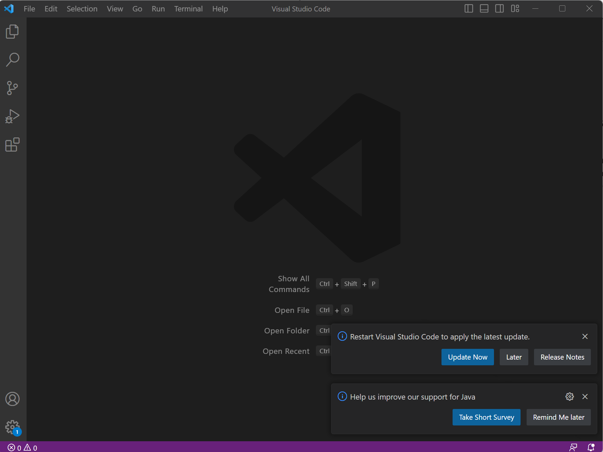
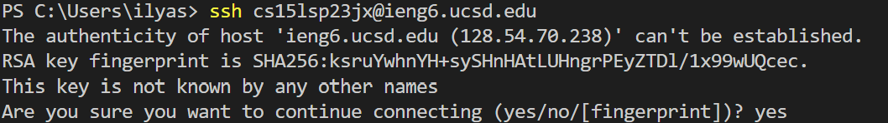
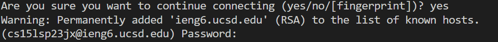
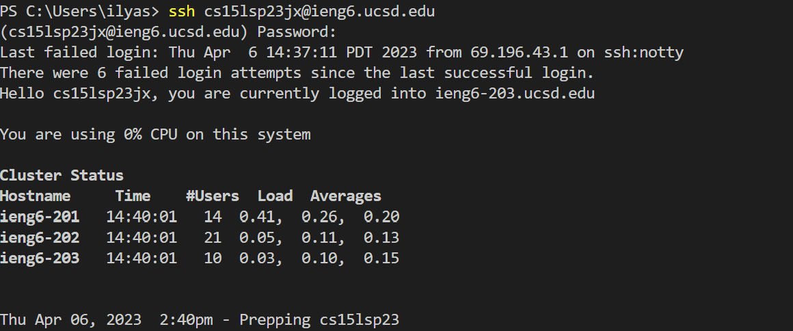
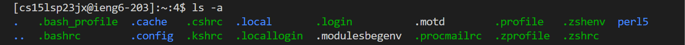

Part 1
The first thing you are going to need to do is find your cse 15L account using the link https://sdacs.ucsd.edu/~icc/index.php
Where you should find something like cs15lwi23zz but the last 2 letters will be unique to your account

Part 2 
The next thing you will need to do is download the source code editor called Visual Studio Code. Go to this link  https://code.visualstudio.com/ and download it the version for your computer type (Mac, Windows). Then follow the instructions on the site. When done installing you should be able to open VS and have a window like this.

Part 3

The next part is remotely connecting to a remote server.
On thing that you will need to do is download git if you are on a windows computer if you are using a Mac git is already downloaded.

Next after installing git open you terminal which is the button in the top left center or your VS window
After you open your terminal type in the terminal the command ssh cs15lsp23xx@ieng.edu replace xx with your account letters from part 1.

After entering that command you should get an output like this

When you see this type “yes”, then hit enter.
You should then get a output like this

When you see this type in your pass from you cse15l account
After entering your password you should get this out put(this one had 6 prior failed password attempts)

You are now connected to the server!

Part 4 
Now that you are connected to the server, lets use the terminal to run some commands 
Here are a few commands you can try cd, ls, ls -a
Here is an example of ls -a running

