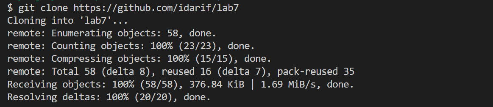
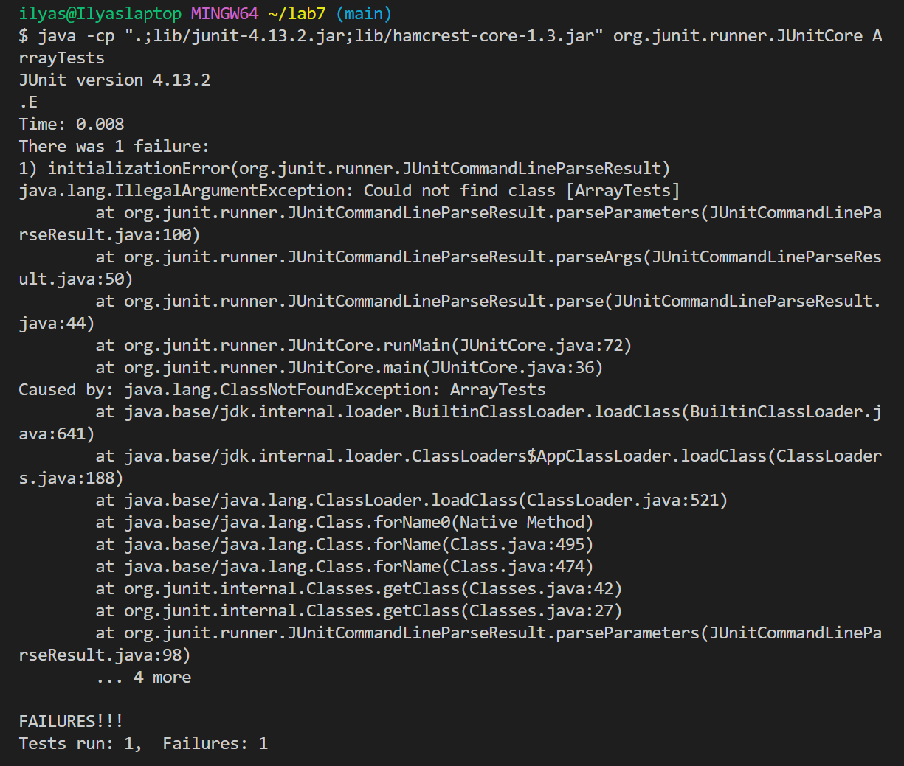
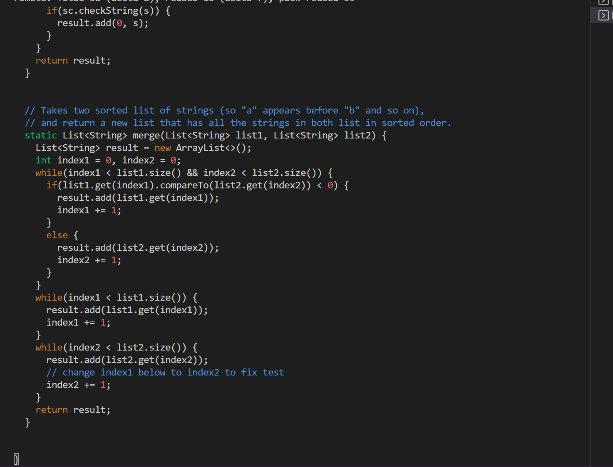
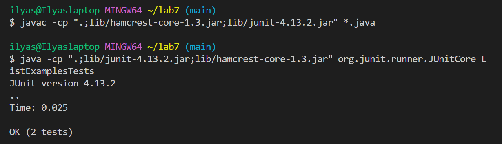
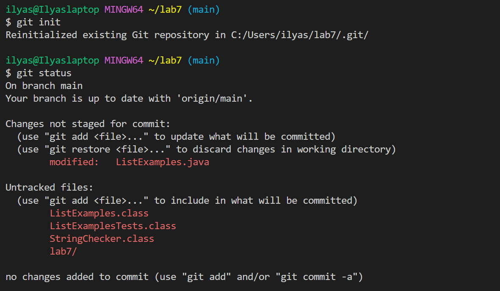
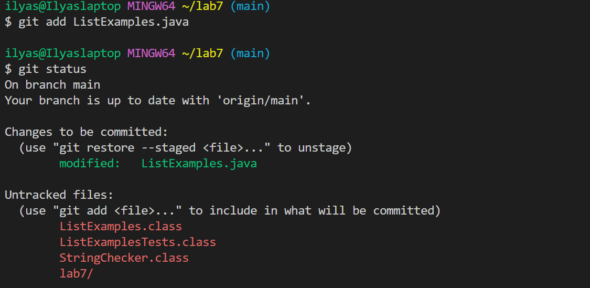
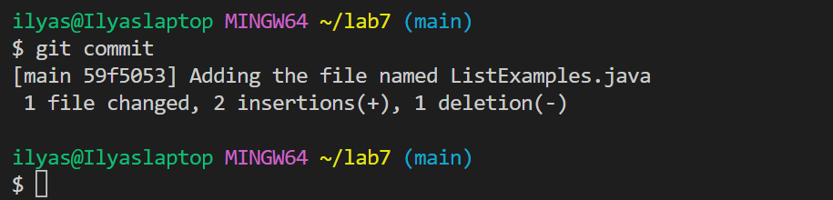

**LAB REPORT 4**
 - was not able to sign because forgot password and are no longer able to change it they way we were showed in the beginning of the quarter
- step 5  i pressed keys: `git clone <space> https://github.com/idarif/lab7`

- step 6 showed that the tests failed
  keys pressed: `bash test.sh`

  
 - step 7 edit code to fix errors
  typed in `vim Listexamples.java`
  after running that this code popped up
  
  i changed index1 to index 2 by clicking keys `<up> <up> <up> <up> <up> <right> <back> <1>`
 - run tests after editing and compiling they passed
  i used keys: `$ javac -cp ".;lib/hamcrest-core-1.3.jar;lib/junit-4.13.2.jar" *.java`
  and `$ java -cp ".;lib/junit-4.13.2.jar;lib/hamcrest-core-1.3.jar" org.junit.runner.JUnitCore ListExamplesTests`
  
  
  - step commit and push, 
  keys used: `git init` `<enter>` then `git status` then `<enter>` this is what showed up
   
   
   
  keys used: `git add ListExamples.java` `<enter>` then `git status` then `<enter>` this is what showed up
  
  
  after that  ityped in `git commit` then in the vim page pressed `i` to start editing and wrote the message
  `<"Adding the file named ListExamples.java">` then clicked `<esc>` then `<:wq> <enter>` and this is what showed up
  
 
