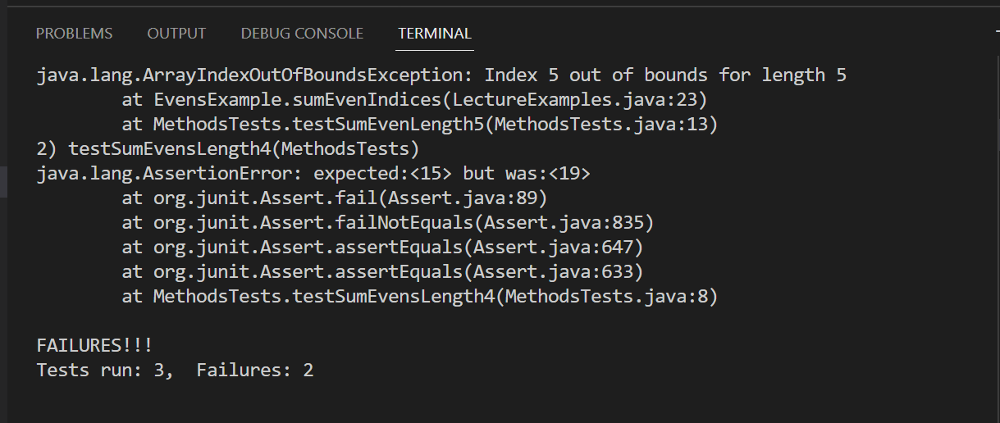
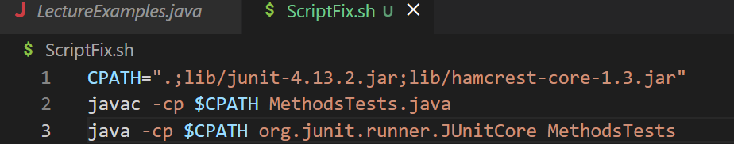
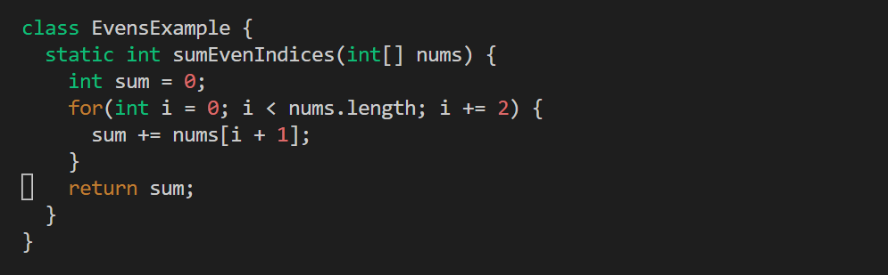
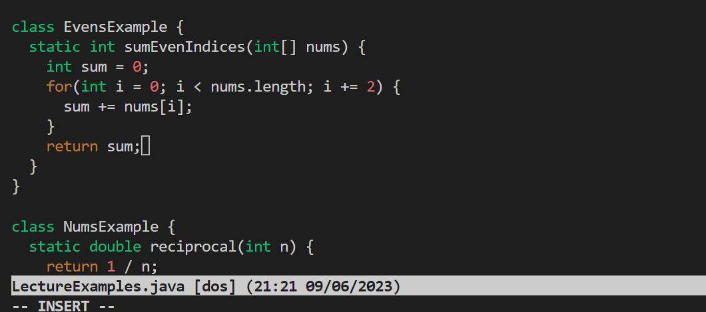
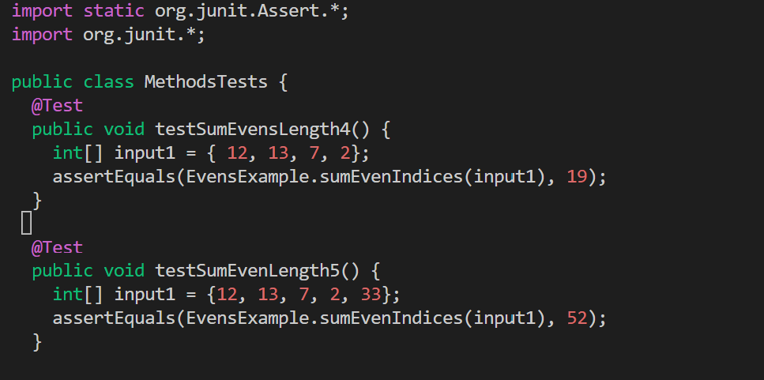
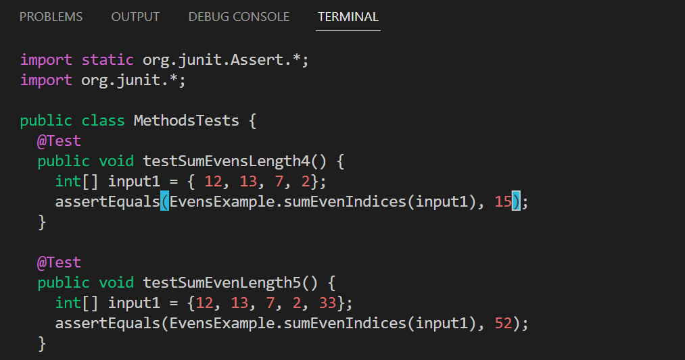
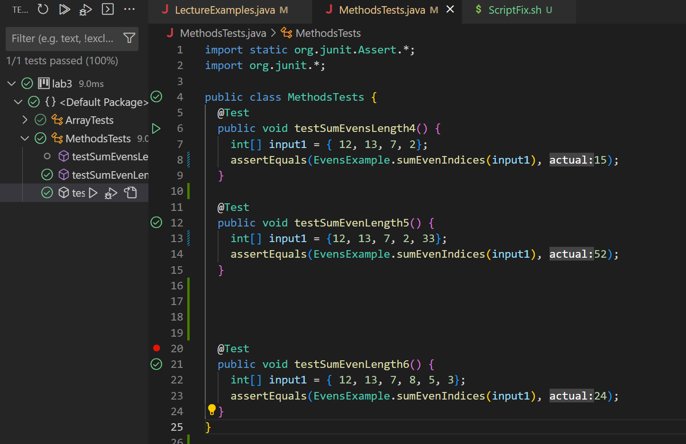
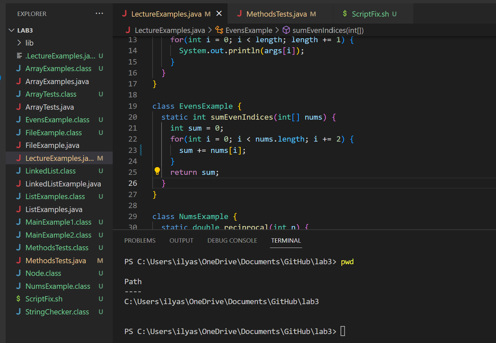
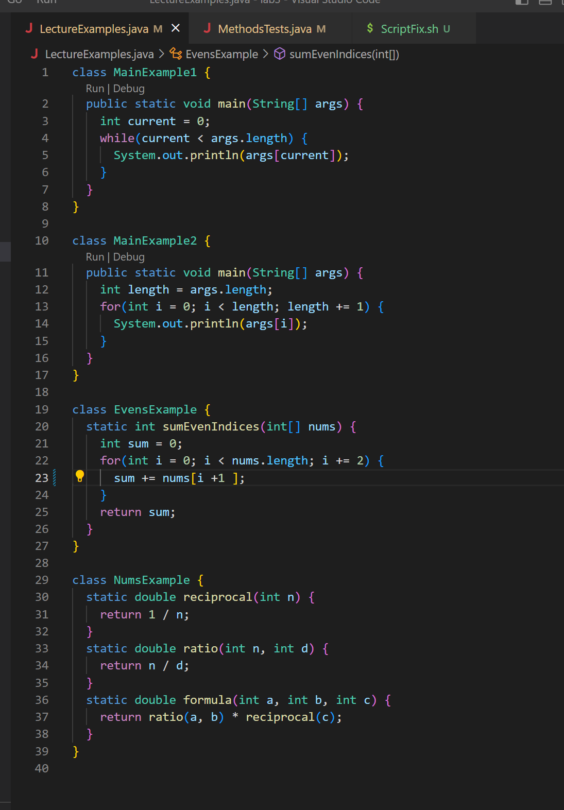
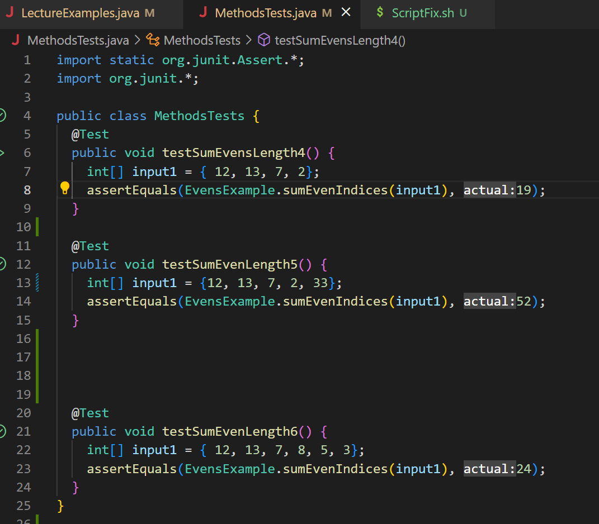

**SCENERIO 1**

**1.** Original post.

Student:
- I was using visual studio code to do my assignment
- After I made a path and ran the code i got the message FAILURES!!! tests run: 3 Failures: 2 
- I was hoping it I would get the result all tests passed when I typed in `bash ScriptFix.sh` it did not and need help fixing the error
here is the screen shot of the terminal output and the path I made

**2.** TA Leading Question.

TA: Well since one of you tests passed that could mean there might be an error in the method tests themselves, you could double check the code there might be a typo or a simple logic error that you may have missed like a simple arithmetic mistake you have made causing the test to fail.

- Student: So I looked at the code again, went into vim to edit the code and found an error in the sumEvensIndices method it had `sum += nums[i + 1];` in the for loop when it should had just been `sum += nums[i];` and fixed it using vim as seen below

- Before

- After

- Student: I also notice that I had made a mistake in the test `testSumEvensLength4` I put the expected value as 19 when it should be 15, I also did this edit in vim as seen in the next to screenshots
 - Before

-After

TA: Ok looks good try running that the same way with `bash ScriptFix.sh` and see what you get it, looks like it should work.

**3.** Another Screenshot/terminal output

- Student: Hmm for some reason im still having one error/fail, the edits did fix one of the failures from earlier but there is still one that says `Index 5 out of bounds for length 5` and im not sure why. 
Here is the screenshot of the message it is giving me in the terminal

- TA: Thats Interesting, can you try right clicking and running the test in the MethodsTests file for me and show me what it says.
- Student: Ok here, it looks like the tests pass but for some reason is giving us that error.

- TA: That is weird, it should be passing everything I am pretty sure, my guess is there might be an issue with the file structure or there could be an issue with bash, because jUnit is still showing the tests passing. You will have to ask Prof. Politz what is wrong with that test and what is causing the error because it looks good otherwise.

**4.** 
- File and directory structure needed.

- All of what was actually needed:
- lib/
- `LecturesExamples.java`
- `MethodsTests.java`
- `hamcrest-core-1.3.jar`
- `junit-4.13.2.jar`

- Contents of the file `LecturesExamples.java` before fixing the bug.

- Contents of the file `MethodsTests.java` before fixing the bug.

- The command line that was ran that triggered the bug: `bash ScriptFix.sh` (basically runnning the program)
- The edits needed to fix the bug were in the `LecturesExample` file where we needed to change `sum += nums[i + 1];` in the `for loop` when it should had just been `sum += nums[i];` in the `EvensExample` class and in the test file `MethodsTests` the test called `testSumEvensLength4` I put the expected value as 19 when it should have been 15.

**REFLECTION**
A couple things I learned that I didnt know before was how to use vim which I thought was kind of a cool way to edit code. Learning how to use git and Github was interesting to learn I have been wanting to learn how to use Github and how to make personal website with it, especially since im trying to get into the programming field that is definitely something I will need and use a lot. Another thing that was cool to learn about was git, I had very little experience with it but even as a bio major I found myself having to learn a little bit about it and how to use some commands in it. So learning more about its purpose and what else it can do other than just move files around in a bio lab was interesting to me.

