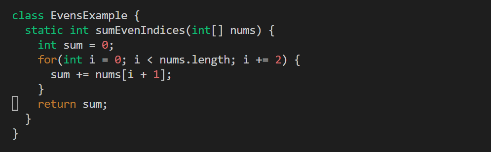

**SCENERIO 1**

Student:
- I was using visual studio code to do my assignment
- after i made a path and ran the code i got the message FAILURES!!! tests run: 3 Failures: 2 
- i was hoping it i would get the result all tests passed when i typed in `bash ScriptFix.sh` but did not and needed help and fixing the error
here is the screen shot of the terminal output and the path i made

TA: well since one of you tests passed that could mean there might be an error in the method, you could double check the code there might be a typo or something of that sort

Student: so i i looked at the code again, went into vim to edit the code and found an error in the sumEvensIndices method it had `sum += nums[i + 1];` in the for loop when it should had just been `sum += nums[i];` and fixed it using vim as seen below
-before

-after

